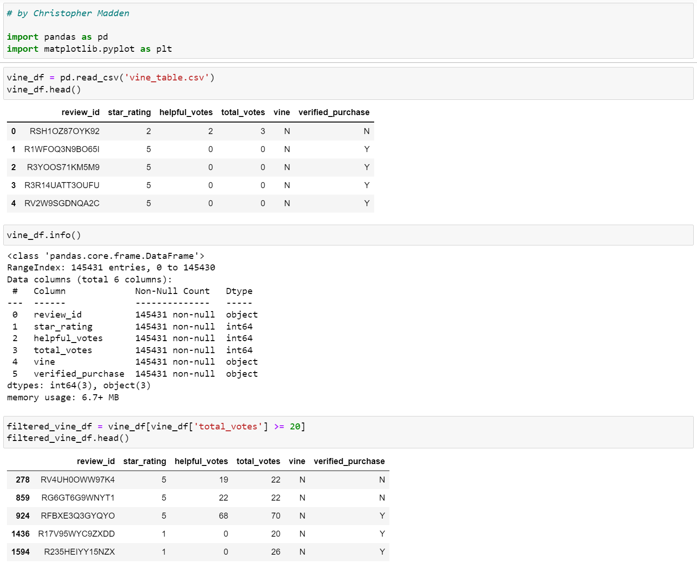
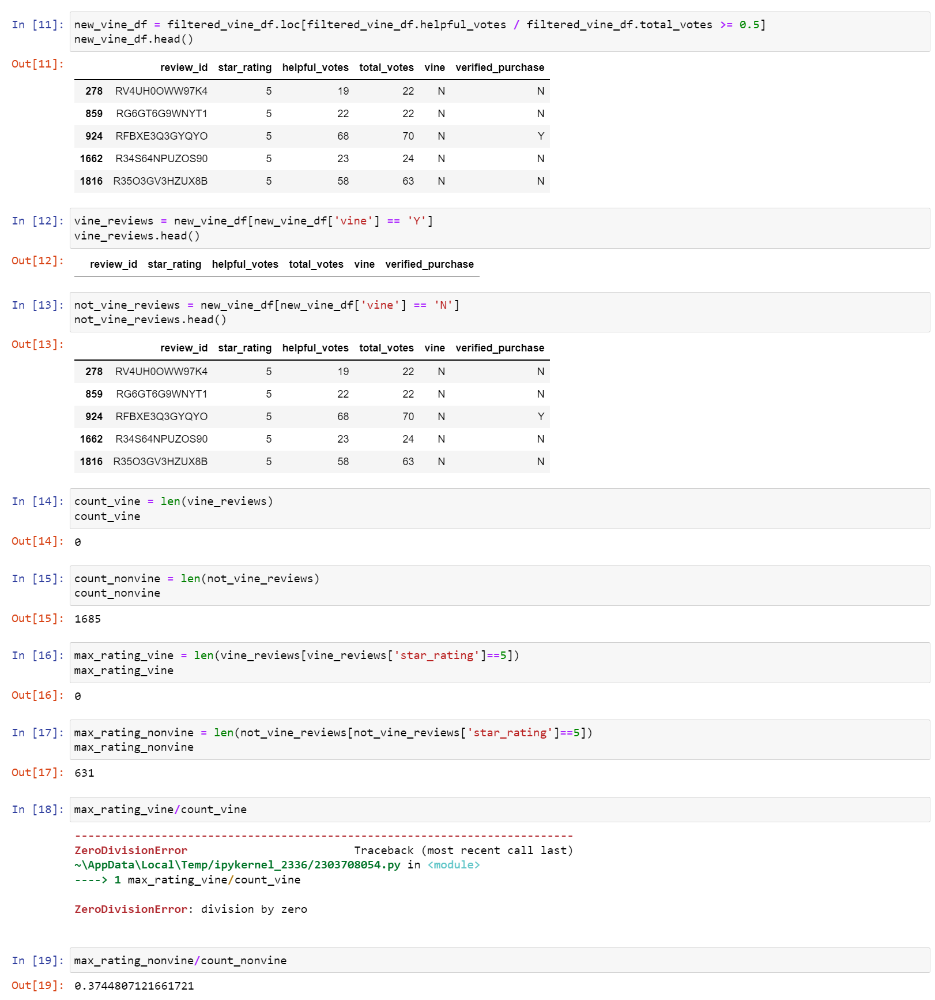

# Amazon_Vine_Analysis

#### by Christopher Madden

## Overview
Create an AWS RDS database with tables in pgAdmin, pick a dataset from the Amazon Review datasets, and extract the dataset into a DataFrame. 
Determine if there is any bias towards reviews that were written as part of the Vine program, to see if having a paid Vine review makes a difference in the percentage of 5-star reviews.

## Results


- How many Vine reviews and non-Vine reviews were there?
  - 0 Vine reviews
  - 1,685 non-Vine reviews
- How many Vine reviews were 5 stars?
  - 0
- How many non-Vine reviews were 5 stars?
  - 631
- What percentage of Vine reviews were 5 stars?
  - 0
- What percentage of non-Vine reviews were 5 stars?
  - 37.4%

## Summary
There is no way of determining whether a bias exists in the data set I chose, Amazon reviews for digital video games.  In my data set there were no vine reviews at all!  We cannot perform any additional analysis on this data set with regards to comparing Vine and non-Vine reviews.  I have succeeded in proving that this data set of reviews will not provide us with the information we are looking for, which is often the case in analytics.


## -----NEW-----


# Amazon Vine Review Bias Analysis | PySpark, AWS RDS, PostgreSQL

**Christopher Madden** | [LinkedIn](http://bit.ly/4uMMPV7) | [GitHub Portfolio](https://bit.ly/3Pz5LS3)

---

## Project Overview

This project uses PySpark and AWS to perform a large-scale ETL pipeline on Amazon product review data, then analyzes whether paid reviews through Amazon's Vine program show a measurable bias toward higher star ratings compared to unpaid reviews.

The dataset selected was Amazon reviews for digital video games, extracted from Amazon's public S3 review datasets, loaded into an AWS RDS PostgreSQL database via pgAdmin, and analyzed using PySpark in Google Colab.

This is a portfolio project completed as part of my Data Analytics Certificate program at Case Western Reserve University (2022).

---

## Tools & Skills Demonstrated

- **Language:** Python (PySpark), SQL
- **Cloud:** AWS RDS, AWS S3
- **Database:** PostgreSQL (pgAdmin)
- **Environment:** Google Colab, Jupyter Notebook
- **Techniques:** ETL pipeline, large-scale data extraction, DataFrame filtering, bias analysis, cloud database loading
- **Competencies:** Big data processing, cloud infrastructure, SQL schema design, data integrity analysis

---

## Pipeline Overview

### Step 1 — ETL: Extract, Transform, Load
Using PySpark, the full Amazon digital video game reviews dataset was extracted from S3, transformed into four structured DataFrames matching the target schema, and loaded into an AWS RDS PostgreSQL instance via pgAdmin.

Tables created:
- `customers_table`
- `products_table`
- `review_id_table`
- `vine_table`

### Step 2 — Vine Bias Analysis

The `vine_table` was filtered to include only reviews with 20+ total votes and at least 50% helpful votes, ensuring only substantive reviews were analyzed.




**Results:**

| Metric | Vine (Paid) | Non-Vine (Unpaid) |
|--------|-------------|-------------------|
| Total Reviews | 0 | 1,685 |
| 5-Star Reviews | 0 | 631 |
| % 5-Star | N/A | 37.4% |

---

## Summary & Analytical Conclusion

The digital video games dataset contained **zero Vine reviews**, making it impossible to perform a direct paid vs. unpaid bias comparison for this category.

Rather than treating this as a failed analysis, this is a meaningful analytical outcome: **the absence of data is itself a finding**. Amazon's Vine program does not appear to be active in the digital video games category, which raises its own business questions about where Vine investment is concentrated.

**Recommended next steps:**
- Re-run the same analysis on a category with robust Vine participation (e.g., electronics, beauty, or outdoor products) to enable a valid comparison
- A category like electronics would likely show a meaningful Vine presence and allow direct bias quantification

This project demonstrates end-to-end cloud ETL capability and the analytical discipline to correctly interpret a null result rather than force conclusions from insufficient data.

---

## Repository Structure

```
Amazon_Vine_Analysis/
├── Amazon_Reviews_ETL.ipynb        # PySpark ETL pipeline notebook
├── Vine_Review_Analysis.ipynb      # Bias analysis notebook
├── challenge_schema.sql            # PostgreSQL table schema
├── vine_table.csv                  # Extracted vine review data
├── Images/                         # Output screenshots
└── README.md
```

---

## About the Author

I am a Data Analyst with experience in SQL, Python, R, Power BI, Tableau, and Excel. I specialize in data cleaning, statistical analysis, dashboard development, and translating complex data into clear business insights.

📧 maddenc33@gmail.com | [LinkedIn](http://bit.ly/4uMMPV7) | [GitHub](https://bit.ly/3Pz5LS3)
